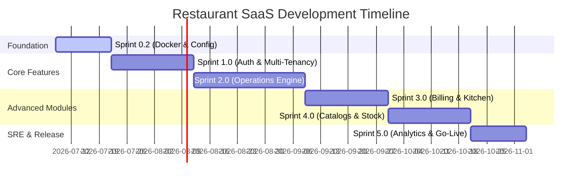

# Product Delivery Roadmap

This roadmap outlines the milestones, epic alignments, and sprints for the Restaurant Management SaaS Platform.

---

## Roadmap Milestones & Epic Timeline

---

## Global Delivery Standards

Every sprint implementation must strictly follow these engineering criteria:

### Definition of Done (DoD)
1.  **Code Quality**: Follows PEP-8 for Python/Django and ESLint/Prettier specs for TypeScript/Angular.
2.  **Testing Cover**: Unit test coverage must exceed 85% for all added modules.
3.  **Data Isolation**: RLS checks verified; changing headers must block cross-tenant database access.
4.  **Logging & Telemetry**: Every write operation logs key parameters (Tenant, User, Correlation ID) to structured logs.
5.  **Offline Sync**: Offline mutations are written to client IndexedDB logs with UUID validation keys.
6.  **Code Review**: Checked and approved by at least one SRE/Lead Developer.

### Standard Acceptance Criteria
1.  **Zero Downtime**: Upgrades must perform rolling container swaps with zero service interruption.
2.  **Response Latency**: Under peak loads, REST APIs must respond in under 100ms, and WebSocket triggers must sync within 200ms.
3.  **Graceful Degradation**: Core floor flows (ordering, kitchen, billing) must remain active even if integrations are offline.

### Verification Standards

#### Automated Verification Steps
1.  **Lint Check**: Run automated linting pipelines (`npm run lint` / `flake8`).
2.  **Unit Tests**: Execute all backend tests (`python manage.py test`) and frontend compilation suites.
3.  **Boundaries Scan**: Execute security tests simulating SQL injection payloads.

#### Manual Verification Steps
1.  **Deployment Verification**: Execute local Compose builds, verifying all 8 containers are in `running` status.
2.  **Health Endpoints**: Access `/api/health/` and check JSON reports.
3.  **Cross-Tenant Isolation Test**: Log in with User A (Tenant X) and try to request a resource ID belonging to Tenant Y. Confirm the system returns a `404 Not Found` or `403 Forbidden` response.

---

## Epic Breakdowns & Sprints

### Epic 0: System Boilerplates & Docker Setup
*   **Sprint 0.2**: Docker Compose configurations, PostgreSQL connection pooling, Redis caching nodes setup, Celery asynchronous queue brokers config, and health checks REST endpoints.
*   **Acceptance Criteria**: All 8 containers run cleanly in a unified local network pool; REST APIs serve JSON health indicators.
*   **Automated Verification**: `docker compose exec backend-api python manage.py test` passes.
*   **Manual Verification**: Fetch `http://localhost:8000/api/health/` and verify databases report `status: OK`.

### Epic 1: Auth & Multi-Tenancy (SaaS Core)
*   **Sprint 1.1**: PostgreSQL Row-Level Security (RLS) policies activation, context middleware interceptors, and user identity registers.
*   **Sprint 1.2**: Custom JWT generation, refresh tokens cookies mapping, dynamic roles dictionary, and OTP authorization flows.
*   **Acceptance Criteria**: Users cannot read or write data unless context tokens match RLS database locks.
*   **Automated Verification**: RLS context test scripts execute without failures.
*   **Manual Verification**: Verify login credentials generate HttpOnly JWT cookies and restrict route access.

### Epic 2: Live Operations Engine (Real-Time Service)
*   **Sprint 2.1**: Interactive visual table grids mappings and customer queues lists.
*   **Sprint 2.2**: Table reservation book registers and order creation pathways.
*   **Sprint 2.3**: WebSockets Daphne channel groups integrations (`tenant:<id>:branch:<id>`) and delta recovery sync.
*   **Acceptance Criteria**: Order status transitions instantly sync across waiter and kitchen screens without manual reloads.
*   **Automated Verification**: Run WebSockets load test script; verify no lost frames.
*   **Manual Verification**: Open two browser tabs; modify table status in Tab A and verify Tab B updates in under 200ms.

### Epic 3: Kitchen & Billing (Fulfillment)
*   **Sprint 3.1**: Kitchen preparation ticket routes and station filters.
*   **Sprint 3.2**: Billing invoice generation, split payment balances calculators, and cash register logs.
*   **Acceptance Criteria**: Orders marked ready in kitchen update wait staff queues and trigger checkout invoice calculations.
*   **Automated Verification**: Billing calculation unit tests pass.
*   **Manual Verification**: Submit kitchen ticket, mark ready, open checkout screen, and split payment among three seats to confirm invoice splits match.

### Epic 4: Catalogs & Stock (Resources)
*   **Sprint 4.1**: Dynamic menus template configurations and branch pricing overrides.
*   **Sprint 4.2**: Recipes definitions, stock adjustments logs, and supplier purchase orders tracking.
*   **Acceptance Criteria**: Ingredient depletion triggers automated alerts when counts hit safety levels.
*   **Automated Verification**: Recipe translation tests pass.
*   **Manual Verification**: Subtract stock to safety threshold and check manager alerts panel.

### Epic 5: Release Verification & Launch
*   **Sprint 5.1**: Data sync pipelines to de-normalized analytics stores and passive AI recommendation widgets.
*   **Sprint 5.2**: Load testing, SRE dashboard setup, alerting integrations, and rolling production release.
*   **Acceptance Criteria**: Platform maintains sub-second page loads under 1000 concurrent user sessions.
*   **Automated Verification**: Run script simulating node failure; check RTO resolves in < 15 mins.
*   **Manual Verification**: Check Grafana dashboard for memory limits alerts.
