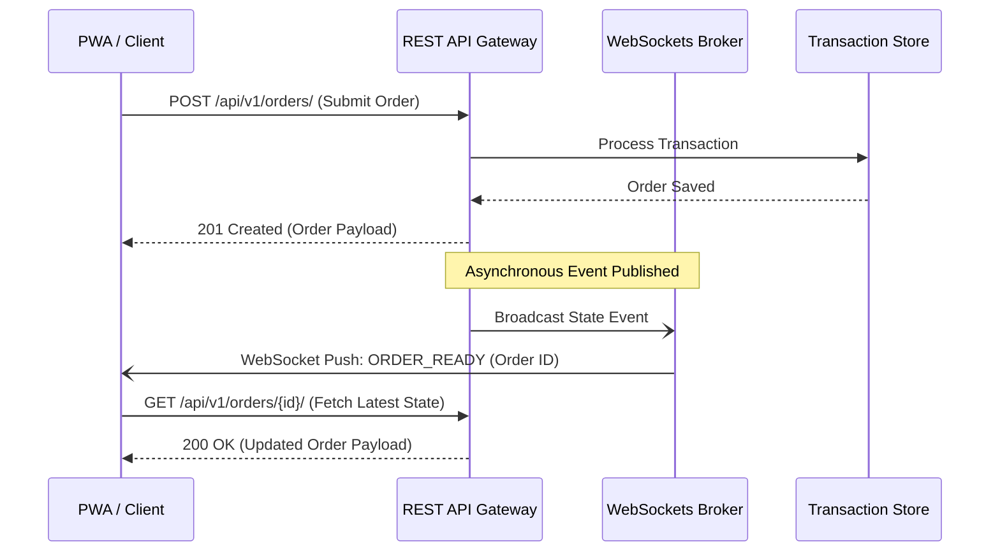

# API Technical Blueprint
## Restaurant Management SaaS Platform (REST & WebSocket Protocol)

---

### 1. API Philosophy & Core Design

#### 1. API Philosophy
The API is the contract of the platform. It must be resource-oriented, consistent, and backward-compatible. Client platforms (web, mobile, kiosks, partner systems) must interact with data uniformly, and the API structure must hide the internal database schema completely.

#### 2. Resource & URI Design Strategy
*   **URI Versioning**: Paths include explicit major version prefixes (e.g., `/api/v1/orders/`).
*   **Logical Resource Paths**: Clean paths using plural nouns for resource collections (e.g., `/api/v1/reservations/`). 
*   **No Context in Paths**: Tenant and branch parameters are passed via custom request headers (`X-Tenant-ID`, `X-Branch-ID`) or resolved from the hostname. They must not reside in the URL path.

---

### 3. API Exchange Formats & Standard Payloads

#### 1. Success Response Standard
All successful responses wrap data in a top-level payload object:
```json
{
  "status": "success",
  "data": {}
}
```

#### 2. Error Response Standard
Error payloads use a consistent JSON format with structured system error codes:
```json
{
  "status": "error",
  "error": {
    "code": "RESOURCE_NOT_FOUND",
    "message": "The requested table does not exist.",
    "details": null
  }
}
```

#### 3. Validation Error Standard
Validation failures return a `400 Bad Request` status and map issues to the corresponding field keys:
```json
{
  "status": "error",
  "error": {
    "code": "VALIDATION_FAILED",
    "message": "Input validation failed for several fields.",
    "details": {
      "phone_number": ["This field is required.", "Enter a valid phone number."],
      "email": ["Enter a valid email address."]
    }
  }
}
```

#### 4. Pagination Metadata Standard
Collections return arrays accompanied by standard pagination indicators:
```json
{
  "status": "success",
  "data": [],
  "pagination": {
    "total_records": 1250,
    "limit": 50,
    "offset": 100,
    "has_next": true,
    "has_previous": true
  }
}
```

---

### 4. API Lifecycle, Safety & Concurrency

#### Idempotency Strategy
*   **Idempotency Key Header**: Write operations (POST/PUT) accept an optional `X-Idempotency-Key` (UUIDv4) header.
*   **Locking Cache**: The API layer registers this key in Redis for 24 hours. If a duplicate request arrives, the backend returns the cached response instead of reprocessing the transaction.

#### Concurrency & Optimistic Locking
*   **Optimistic Versioning**: High-contention entities (such as inventory levels or seating availability) contain an incremented version counter.
*   **Precondition Check**: Updates require the client to supply the current version in an `If-Match` header. If the version has shifted, the API returns `412 Precondition Failed`, prompting the client to refresh and retry.

#### Rate Limiting & Gateway Strategy
*   **Rate Limits**: Limits are evaluated by identity context (IP, User ID, API Key) in Redis.
*   **Tenant Limits**: Rate configurations are loaded dynamically based on the tenant’s subscription limits.

---

### 5. Real-Time Contracts (REST & WebSockets Coordination)

To prevent split-path sync issues, REST and WebSockets act in cooperation:



*   **Commands (Writes) via REST**: All mutations (placing orders, modifying queues, processing payments) must execute as synchronous REST requests. WebSockets must never be used to send database writes to the server.
*   **Events (Push) via WebSockets**: WebSockets are used for push notifications (e.g., `QueueItemUpdated`, `KitchenTicketReady`).
*   **Data Integrity Sync**: WebSocket events carry lightweight event signals (event name, entity ID, timestamp). Upon receipt, the client updates its UI state by querying the latest state via REST, preventing desynchronization.

---

### 6. Public vs. Internal API Boundaries

The API layer enforces separation between four execution profiles:

1.  **Platform APIs**: Used for SaaS configuration, onboarding, license enforcement, and feature flags. Security: Restricted to verified Platform Team session tokens.
2.  **Restaurant Internal APIs**: Used by restaurant staff (waiters, cashiers, kitchen displays). Security: Authenticated with JWT, verified against Tenant/Branch scopes.
3.  **Customer APIs**: Used for customer self-service (ordering at tables via QR, queue joining). Security: Authenticated via mobile phone OTP context.
4.  **Partner & Integrations APIs**: Used for third-party integrations (Swiggy, Zomato, delivery services, payment gateways). Security: Verified via cryptographically signed API Keys with strict permissions access constraints.

---

### 7. API Golden Rules

API developers must adhere strictly to these rules:

> [!CAUTION]
> 1. **Never Break Existing Contracts**: Never change, rename, or delete fields in standard success/error structures. If structural updates are needed, deploy a new API version.
> 2. **Never Expose Internal Database Schemas**: Keep resource representations abstract. Database primary keys (except UUIDs), physical column names, and table structures must be mapped to neutral API names.
> 3. **Never Leak Tenant Information**: Queries must enforce isolation at the entry point. The presence of `X-Tenant-ID` is verified by the API gateway on all tenant endpoints.
> 4. **Never Return Unnecessary Data**: Payloads must be compact. Do not return full objects if the client only needs identifiers, reducing bandwidth overhead.
> 5. **Never Trust Client State**: The API must validate calculations, permissions, pricing balances, and state transitions on every write, ignoring client validation claims.
> 6. **Consistent JSON Format Throughout**: Every endpoint must wrap its output in the standardized `"status": "success"` or `"status": "error"` envelope. Custom, untagged JSON structures are forbidden.

---

### 8. Implementation Readiness

The API architecture is complete. Standard response structures, validation error formats, pagination rules, idempotency procedures, and REST-WebSocket integration strategies are fully defined.

No further details are needed to start coding API endpoints.
