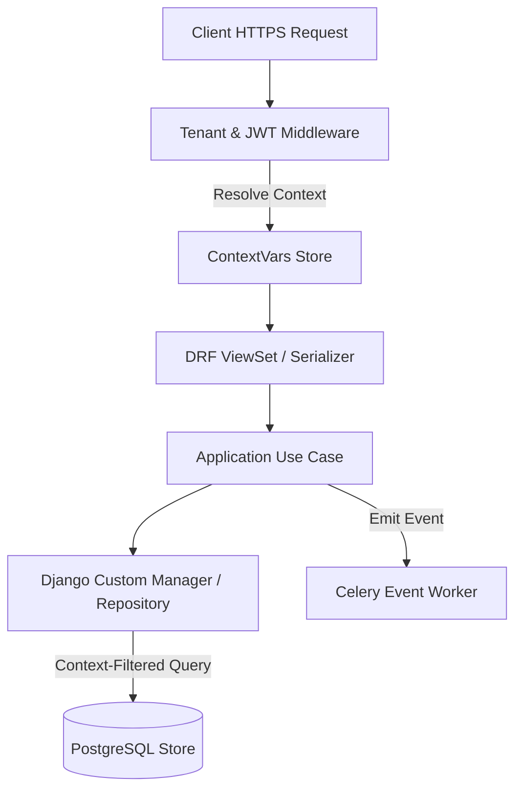

# Backend Technical Blueprint
## Restaurant Management SaaS Platform (Django 5 Engine)

---

### 1. Backend Architecture Overview
The backend is structured as a **Modular Monolith** using **Django 5** and **Django REST Framework (DRF)**. Core real-time transport is handled by **Django Channels** under an ASGI setup (Daphne/Uvicorn), and asynchronous processing is delegated to **Celery** with **Redis** serving as the shared message broker and channel layer. Data persistence utilizes **PostgreSQL** with logical partitioning and context interception.

---

### 2. Core Backend Layer Strategy

#### 1. Backend Project Organization
The project resides in a single repository root. Business capabilities are separated into independent Django applications located inside an `apps/` directory.

#### 2. Layer Definitions within Django Apps
To preserve Clean Architecture boundaries, each Django application must enforce the following folder segregation:
*   `domain/`: Pure Python classes, value objects, and exception types. **Forbidden to import `django` or any database ORM components.**
*   `application/`: Service orchestrators and use case classes. Defines persistence port interfaces.
*   `interface/`: ViewSets, Serializers, WebSockets Consumers, and HTTP route mapping.
*   `infrastructure/`: Django ORM Models, custom Managers, migration files, and third-party integration adapters.

#### 3. Request Lifecycle

---

### 3. Context & Authorization Lifecycles

#### Tenant & Branch Context Resolution
1.  **Middleware Extraction**: A custom Django middleware intercepts incoming requests and extracts the `Tenant-ID` (from custom header or subdomain) and `Branch-ID` (from query params or header).
2.  **Thread-Safe Storage**: Context IDs are written to a thread-safe `contextvars` variable.
3.  **ORM Query Interception**: A base custom Django model manager (`TenantManager`) overrides the default `.get_queryset()` method on all tenant-owned models to automatically apply `.filter(tenant_id=current_context_tenant_id())`.

#### Authentication & Authorization
*   **Authentication**: Managed by Django REST Framework SimpleJWT, utilizing short-lived access tokens and HttpOnly refresh cookies. Mobile-first customer authentication operates via an OTP session validation log.
*   **Authorization Boundary**: DRF permissions match HTTP actions against dynamic user permission keys retrieved via the user identity broker for the active tenant/branch context.

---

### 4. Code Abstraction Strategies

#### Repository & Service Layer Patterns
*   **Repository Interface**: The Application layer defines repository interface classes (ports). Concrete implementations (adapters) reside in `infrastructure/repositories.py` using Django QuerySets.
*   **Use Cases**: Standard operations instantiate a single use case class, executing a specific business mutation, wrapping database actions inside Django's `transaction.atomic` blocks.

#### Validation & Exception Handling
*   **Data Structure Validation**: DRF serializers handle serialization and type validation at the Interface layer.
*   **Domain Rule Validation**: Domain services evaluate business limits (e.g., pricing, status paths) and raise custom domain exceptions.
*   **API Exception Mapping**: A custom DRF exception handler catches domain exceptions and returns structured, standardized JSON error responses with consistent operational codes to the client.

---

### 5. Asynchronous, Caching & Real-Time Engines

#### Redis Responsibilities
*   **Shared Cache**: Caches global tenant dictionaries, permission maps, and menu catalog configurations.
*   **WebSocket Channel Layer**: Serves as the message broker backend for Django Channels.
*   **Celery Message Broker**: Serves as the transport queue for background task execution.

#### Celery Responsibilities
*   **Background Tasks**: Processes asynchronous mail dispatches, SMS notifications, and audit log pipelines.
*   **Priority Queues**: Tasks are segregated into dedicated worker queues: `realtime_print`, `audit_write`, `alert_notifications`, and `analytics_batch`.
*   **Periodic Tasks**: Scheduled routines (inventory audit alerts, automated subscription checkouts, daily analytics caching) are run via Celery Beat.

#### Django Channels (ASGI) Responsibilities
*   **Daphne/Uvicorn ASGI Routing**: Routes WebSockets connections to role-specific Consumers.
*   **Channel Groups Partitioning**: Rooms are mapped dynamically: `tenant_<tenant_id>_branch_<branch_id>`. Waiters, cashiers, and kitchen screens subscribe to these groups.
*   **Broadcast Handling**: Consumers accept in-process notifications from the Celery worker pool and emit lightweight JSON state updates to clients.

---

### 6. Configuration & Operational Health

#### Environment & Configuration
*   **Settings Management**: Django configuration uses `django-environ` to read keys from system variables.
*   **Feature Flags**: Tenant-specific capability toggles are resolved dynamically at runtime by checking the tenant's configuration catalog in Redis.

#### Health Checks & Observability
*   **Health Check Endpoint**: A dedicated health API endpoint checks connection latency for PostgreSQL, Redis, and Celery worker health.
*   **Structured Logging**: Django logger is customized to output structured JSON format logs containing `tenant_id`, `branch_id`, and `user_id` flags.

#### Testing Strategy
*   **Isolated Unit Tests**: Python unit tests run using mock data stores. The database is replaced with in-memory SQLite instances or mock DB connections, checking use case logic.
*   **Tenant Separation Integration Testing**: Integration tests run concurrent requests simulating different tenants, verifying database interceptors completely isolate outputs.

---

### 7. Application breakdowns (Django Apps)

The modular monolith is partitioned into seven core Django applications:

#### 1. `apps.tenants`
*   **Purpose**: Tenant onboarding, branch allocation, metadata catalogs, and platform licensing.
*   **Dependencies**: None (Root configuration app).
*   **Public Interfaces**: Tenant registration service, branch config resolver, metadata validation service.
*   **Events Produced**: `TenantProvisioned`, `BranchLimitsUpdated`, `MetadataCatalogModified`.
*   **Events Consumed**: None.
*   **Security/Audit**: Restricted to Platform Admin tokens. Action logs written to the immutable audit database.

#### 2. `apps.authentication`
*   **Purpose**: User identity management, OTP session logs, custom JWT processing, dynamic permissions, and role mapping.
*   **Dependencies**: `apps.tenants`.
*   **Public Interfaces**: OTP request handler, token verification service, CBAC permission broker.
*   **Events Produced**: `UserLoggedIn`, `OTPCodeDispatched`, `UserTenantRoleModified`.
*   **Events Consumed**: None.
*   **Security/Audit**: Strict lockout limits on OTP retries; registers access attempts.

#### 3. `apps.operations`
*   **Purpose**: Dining tables layout mapping, customer queue waitlists, reservation registers, and active order pipelines (dine-in, takeaway).
*   **Dependencies**: `apps.tenants`, `apps.authentication`.
*   **Public Interfaces**: Queue registration pipeline, table allocation engine, order state mutation endpoint.
*   **Events Produced**: `OrderSubmitted`, `OrderStateChanged`, `TableStateChanged`, `QueuePositionAdvanced`.
*   **Events Consumed**: `PaymentSettled`.
*   **Security/Audit**: Checks staff branch permissions prior to order or table updates.

#### 4. `apps.billing`
*   **Purpose**: Bill calculation, invoicing, discount approvals, payment gateway routing, and cashier session registry.
*   **Dependencies**: `apps.tenants`, `apps.operations`.
*   **Public Interfaces**: Invoicing constructor, payment poster, refund processor.
*   **Events Produced**: `InvoiceCreated`, `PaymentSettled`, `RefundProcessed`, `CashierSessionClosed`.
*   **Events Consumed**: `OrderSubmitted`.
*   **Security/Audit**: Mandatory audit logs for refunds, cash adjustments, and manual discount entries.

#### 5. `apps.catalog`
*   **Purpose**: Menu creation, isolated branch pricing configurations, recipe lists, inventory stock tracking, and supplier registries.
*   **Dependencies**: `apps.tenants`.
*   **Public Interfaces**: Menu item validator, inventory stock counter, supplier purchase order creator.
*   **Events Produced**: `InventoryLowAlert`, `MenuItemDisabled`, `PurchaseOrderIssued`.
*   **Events Consumed**: `OrderSubmitted`, `OrderStateChanged` (triggers ingredient depletion on ticket ready).
*   **Security/Audit**: Restricts write commands to authorized managers; tracks adjustments to supplier prices.

#### 6. `apps.communication`
*   **Purpose**: Template management, background messaging dispatches (SMS, email, push), and notifications history.
*   **Dependencies**: `apps.tenants`.
*   **Public Interfaces**: Dispatch task wrapper, template content compiler.
*   **Events Produced**: `MessageSent`, `MessageFailed`.
*   **Events Consumed**: Subscribes to events on the bus (e.g., `OrderSubmitted`, `QueuePositionAdvanced`, `OTPCodeDispatched`).
*   **Security/Audit**: Masks sensitive auth tokens and customer phone numbers in transaction logs.

#### 7. `apps.audit`
*   **Purpose**: Capture security actions (voids, overrides, password resets) in an immutable log store.
*   **Dependencies**: `apps.tenants`.
*   **Public Interfaces**: Append-only log writer service, audit reader endpoint.
*   **Events Produced**: None.
*   **Events Consumed**: Subscribes to critical actions (e.g., `RefundProcessed`, `UserTenantRoleModified`).
*   **Security/Audit**: Read access restricted exclusively to the Platform Team and Tenant Owners.

---

### 8. Backend Golden Rules

Django backend developers must strictly follow these rules:

> [!CAUTION]
> 1. **Never Import Models Across Django Apps**: If App A needs data from App B, it must call App B’s service API or use an ID reference. Importing models from other applications is forbidden.
> 2. **Never Write Business Logic inside Views, Serializers, or Models**: Views route requests, Serializers format data, and Models represent data schemas. Core calculations, status rules, and workflows must reside exclusively in domain services and use cases.
> 3. **Never Query Without the Tenant Context Manager**: Database queries must use custom model managers that apply context filters. Direct raw SQL execution bypassing the query broker is banned.
> 4. **No Blocking Operations in the Request-Response Loop**: Never execute third-party API calls (e.g., SMS gateways, payment APIs, thermal printing commands) inside HTTP requests. Delegate all external connections to Celery background tasks.
> 5. **Client-Side Validation is a UI Convenience**: Never trust data sent by the client. The backend must validate all schemas, user identities, permissions, pricing balances, and ingredient levels on every request.
> 6. **Database Transactions Must Be Compact**: Keep `transaction.atomic` blocks as small as possible. Never place network queries or slow tasks inside a database lock context.
> 7. **All Transaction Tables Must Use UUIDs as Primary Keys**: Every transactional table (orders, queues, invoices, bills) must be keyed on client-generated UUIDs to support future offline sync pipelines.
