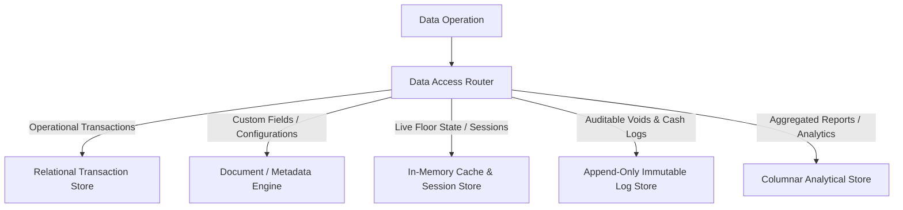

# Database Architecture Specification
## Restaurant Management SaaS Platform

---

### 1. Data Storage Strategy

We adopt a **Polyglot Persistence Strategy** where storage engines are aligned with data patterns. This avoids trying to fit all data types into a single storage format.

---

### 2. Architectural Storage Categories

| # | Storage Category | Structural Pattern | Archival Threshold | Recovery Priority |
|---|---|---|---|---|
| **1** | **Transactional Data** | Relational, ACID-compliant, highly indexed on context keys. | Move to Warm at 90 days; Cold at 1 year. | **Critical (Tier 1)** |
| **2** | **Reference Data** | Relational, read-heavy, tenant-shared templates. | Never archived; soft-deletes only. | **High (Tier 2)** |
| **3** | **Configuration Data** | Document-oriented, read-only at transaction runtime. | Never archived; version-controlled. | **High (Tier 2)** |
| **4** | **Metadata Storage** | Document / Relational hybrid (nested schema dictionary). | Never archived; updated on schema shifts. | **High (Tier 2)** |
| **5** | **Analytics Storage** | De-normalized, columnar, optimized for bulk aggregation. | Retained indefinitely (highly compressed). | **Medium (Tier 3)** |
| **6** | **Audit Storage** | Append-only, write-once log engine. | Archive to cold storage at 2 years. | **High (Tier 2)** |
| **7** | **Cache Store** | Key-Value, in-memory, volatile. | Evicted automatically (TTL). | **Low (Transient)** |
| **8** | **Session Storage** | Key-Value, encrypted payloads, user-session mapped. | Evicts on token expiration. | **Medium (Transient)** |
| **9** | **Background Job Storage** | Priority queue states, worker statuses. | Purged instantly upon completion. | **Low (Transient)** |
| **10** | **Notification Storage** | Relational ledger of alerts, templates, and history. | Purge read notifications at 30 days. | **Low (Tier 4)** |

---

### 3. Core Database Operations & Management

#### Dynamic Customization Strategy (Metadata)
*   **Dynamic Schemas**: Dynamic fields (e.g., custom attributes on a menu item or customer profile) are stored using structured, queryable document attributes (like JSONB) nested inside standard relational tables.
*   **Schema Catalog Validation**: Any custom field write must refer to a Tenant-wide Metadata Dictionary. This catalog restricts keys and data types, protecting against schema chaos.

#### Tenant Isolation Strategy
*   **Logical Composite Partitioning**: Every table containing tenant-owned data contains a composite key (`tenant_id`, `branch_id`).
*   **Query Interception**: The platform's data access broker intercepts all incoming SQL queries, appending dynamic isolation filters (e.g., `WHERE tenant_id = x AND branch_id = y`) to ensure data cannot leak across tenants.

#### Data Lifecycle & Archiving Strategy
*   **Hot Phase**: Active operations (live orders, active tables, current week bookings) reside in high-speed transactional storage.
*   **Warm Phase**: Transaction history of the current calendar year is maintained in the main store but marked read-only.
*   **Cold Phase**: Transactions older than 1 year are moved to highly compressed, read-optimized columnar tables in the analytical partition.

#### Indexing Philosophy
*   **Context Indices**: Compulsory composite indexes are built on the logical partition keys (`tenant_id`, `branch_id`).
*   **Metadata Path Indexing**: Dynamic metadata fields are indexed using generalized inverted indexing tools (e.g., GIN indexation for JSON fields), ensuring search speeds remain high even for user-defined attributes.

#### Disaster Recovery & Backup Philosophy
*   **Continuous Replication**: Write operations are replicated in real time to hot standby replicas in separate physical availability zones.
*   **Point-in-Time Recovery (PITR)**: Transaction logs are continually streamed to immutable backup vaults, enabling the database to be restored to any exact millisecond in the event of major corruption.
*   **Backup Anti-Tampering**: Backups are written using write-once-read-many (WORM) storage locks to prevent malicious deletion by compromised administration accounts.

---

### 4. Business Data Domain Definitions

#### 1. Platform Domain
*   **Purpose**: Manages SaaS licensing, tenant registration, branch allocations, and system feature flags.
*   **Ownership**: Global (Platform Team).
*   **Lifecycle**: Permanent. Records are never deleted.
*   **Relationships**: Root parent of all Tenants.
*   **Criticality**: High (Core licensing).

#### 2. Tenant Domain
*   **Purpose**: Manages the core restaurant brand identity, global catalogs, configuration dictionary, and billing subscription.
*   **Ownership**: Tenant-level.
*   **Lifecycle**: Permanent while the subscription is active. Soft-delete on cancel.
*   **Relationships**: Child of Platform; parent of Users, Customers, and Branches.
*   **Criticality**: High (Identifies isolation boundaries).

#### 3. Branch Domain
*   **Purpose**: Manages specific branch coordinates, local operational toggles, and staff assignments.
*   **Ownership**: Tenant-level.
*   **Lifecycle**: Permanent while branch is operational.
*   **Relationships**: Child of Tenant; parent of Tables, Queues, Reservations, and Inventory.
*   **Criticality**: High (Identifies execution boundaries).

#### 4. Users, Roles & Permissions Domain
*   **Purpose**: Manages staff identity, authorization scopes, dynamic role collections, and system permission keys.
*   **Ownership**: Global for permissions; Tenant-level for Users and Roles.
*   **Lifecycle**: Long-term. User accounts are maintained indefinitely (soft-delete for staff termination to protect audit trails).
*   **Relationships**: Linked to Tenant and Branches via UserTenantRole mappings.
*   **Criticality**: Critical (Enforces platform security).

#### 5. Customers Domain
*   **Purpose**: Manages customer profiles, OTP credentials, loyalty points, rewards, and contact information.
*   **Ownership**: Tenant-level (Brand-wide).
*   **Lifecycle**: Long-term.
*   **Relationships**: Child of Tenant; parent of Reservations and Orders.
*   **Criticality**: High (Stores PII and financial loyalty points).

#### 6. Orders Domain
*   **Purpose**: Manages live dine-in, takeaway, and delivery orders, item states, preparation notes, and pricing.
*   **Ownership**: Branch-level.
*   **Lifecycle**: Short-term mutation. Active transitions take minutes; completed orders shift to read-only.
*   **Relationships**: Child of Branch and Customer; parent of Kitchen tickets and Billing transactions.
*   **Criticality**: Critical (Core operational revenue loop).

#### 7. Kitchen Domain
*   **Purpose**: Manages preparation tickets, station allocations, ticket routing, and completion speeds.
*   **Ownership**: Branch-level.
*   **Lifecycle**: Short-term. Exists only during preparation cycle, then archives.
*   **Relationships**: Child of Order and Branch.
*   **Criticality**: High (Drives physical operations velocity).

#### 8. Inventory Domain
*   **Purpose**: Tracks raw ingredient counts, stock adjustments, purchase orders, recipes, and vendor lists.
*   **Ownership**: Configurable (can be shared Tenant-wide or branch-isolated).
*   **Lifecycle**: Medium-term. Continuous updates on stock, historical log preservation for waste analysis.
*   **Relationships**: Linked to Branch, Menu Items, and Suppliers.
*   **Criticality**: Medium-High (Direct cost tracking).

#### 9. Billing & Payments Domain
*   **Purpose**: Manages cash logs, calculated invoices, partial payments, refund traces, and tax logs.
*   **Ownership**: Branch-level.
*   **Lifecycle**: Permanent. Records must not be altered after settlement.
*   **Relationships**: Child of Order.
*   **Criticality**: Critical (Financial and compliance accounting).

#### 10. Reports & Analytics Domain
*   **Purpose**: Aggregates sales volume, peak-hour bottlenecks, inventory waste, and employee performance.
*   **Ownership**: Tenant-level (consolidated) and Branch-level (isolated).
*   **Lifecycle**: Long-term. Reports are cached; underlying de-normalized analytical records are kept permanently.
*   **Relationships**: Consumes streams from Orders, Billing, and Inventory.
*   **Criticality**: Medium (Decision support).

#### 11. AI Domain
*   **Purpose**: Stores anomaly flags, predictive stock volumes, queue forecasts, and user reaction history.
*   **Ownership**: Tenant-level.
*   **Lifecycle**: Medium-term. Data is updated as model evaluations refresh.
*   **Relationships**: References Orders, Queue, and Inventory datasets.
*   **Criticality**: Low (Operational assistant).

#### 12. Customization Domain
*   **Purpose**: Maps dynamic workflow configurations, custom form rules, custom roles, and UI branding fields.
*   **Ownership**: Tenant-level.
*   **Lifecycle**: Permanent. Updates occur when the restaurant owner changes configurations.
*   **Relationships**: Child of Tenant; governs metadata structures for all operational modules.
*   **Criticality**: High (Governs runtime data routing).

#### 13. Communication & Notifications Domain
*   **Purpose**: Stores notification templates, history, delivery status, and campaign logs.
*   **Ownership**: Tenant-level.
*   **Lifecycle**: Short-term. Log histories are purged or compressed after 30 days.
*   **Relationships**: References Users and Customers.
*   **Criticality**: Medium (External guest and staff communication).

#### 14. Audit Domain
*   **Purpose**: Captures immutable changes (e.g., ticket deletions, invoice refunds, price shifts) to audit staff behavior.
*   **Ownership**: Tenant-level.
*   **Lifecycle**: Permanent (minimum 2 years in hot storage, archived to cold WORM storage).
*   **Relationships**: Independent ledger mapping User actions to resource mutations.
*   **Criticality**: High (Anti-fraud and accountability).

---

### 5. Implementation Readiness

The database architecture is complete enough to proceed to physical schema design. No further product boundaries need to be defined.

When we begin writing concrete database schemas, the design sequence must be:
1.  **Platform & Tenant Core Configuration Schema**: The root platform metadata, billing parameters, feature flag registers, and tenant schemas.
2.  **Identity, Custom Roles & CBAC Authorization Schema**: The tables mapping users, credentials, dynamic role maps, and permissions mappings.
3.  **Core Transactional Operations Schema**: The relational tables mapping Branches, Tables, Reservations, Queues, Orders, and Kitchen tickets.
4.  **Billing, Payments & Compliance Accounting Schema**: The transactional database constraints mapping invoices, split payments, refunds, and cashier registers.
5.  **Dynamic Metadata Catalog & Schema Dictionary**: The tables hosting the custom fields definitions, dynamic state transitions, and customization schemas.
6.  **Inventory, Suppliers & Recipe Schema**: Stock mappings, stock mutations log, vendor relations, and ingredient conversion metrics.
7.  **Analytical & Columnar History Schemas**: The de-normalized structures for aggregated analytical reporting and historical archiving.
