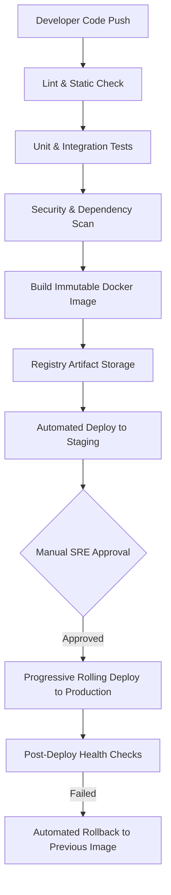

# DevOps & Deployment Technical Blueprint
## Restaurant Management SaaS Platform (Infrastructure & SRE Specification)

---

### 1. DevOps & Infrastructure Philosophy
We adopt an **Infrastructure as Code (IaC)**, containerized, and immutable deployment philosophy. The infrastructure is cloud-agnostic, designed to deploy on any production container orchestration platform (e.g., managed Kubernetes or container runtime engines). The core focus is maintaining high availability, sub-second latency, and isolation for restaurant checkout and kitchen queues.

---

### 2. Environment Strategy

We define four distinct environments:

| Environment | Purpose | Infrastructure Strategy | Deploy Pipeline |
|---|---|---|---|
| **Development** | Local developer testing. | Local Docker Compose, mock integrations. | Local run. |
| **Testing** | CI verification loop. | Ephemeral container runners, database mocks. | Automated on PR submit. |
| **Staging** | Production mirror verification. | Scaled-down mirror of production, real APIs. | Automated on merge to `main`. |
| **Production** | Live tenant operations. | High-availability cluster, hot replicas, CDN. | Progressive rolling update (with manual approval gate). |

---

### 3. Container & Proxies Topology

#### 1. Container Responsibilities
*   `proxy`: Reverse proxy and TLS termination (Nginx).
*   `frontend`: Serves static compiled Angular assets and service workers.
*   `backend-api`: Django Web / REST API handler.
*   `backend-ws`: Daphne / Django Channels ASGI real-time message handler.
*   `celery-worker`: Executes asynchronous tasks separated by priority queues.
*   `celery-beat`: Singleton scheduler for periodic tasks.

#### 2. Reverse Proxy & Domain Routing Strategy
*   **Routing**: The proxy intercepts requests, routes `/ws/` to the Channels ASGI pool, `/api/` to the backend REST API pool, and other traffic to the static frontend.
*   **Domain Routing**: Multi-tenant subdomains (e.g., `brand-name.platform.com`) are dynamically mapped via DNS wildcards (`*.platform.com`). The proxy forwards host headers down to the backend context broker.

---

### 4. CI/CD Pipeline & Progressive Deployments

*   **Database Migrations Execution**: Database migrations run as a pre-deploy check in the CD pipeline.
*   **Backward Compatibility Constraint**: Migrations must be designed for backward compatibility (two-phase additions: deploy schema, deploy code, deprecate old schema columns) to allow old container versions to continue running during the rolling transition.
*   **Rollback Strategy**: If post-deploy health checks fail, the router instantly reverts traffic routing to the previous immutable container image.

---

### 5. Observability & SRE Architecture

#### 1. Correlation ID Tracing
*   **ID Generation**: The Nginx proxy generates a unique `X-Correlation-ID` (UUIDv4) header on every incoming request.
*   **Context Propagation**: The correlation ID passes down to the REST API, WebSocket consumers, Celery tasks, and SQL queries.
*   **Aggregated Logs**: Allows developers to trace an action end-to-end across multiple containers.

#### 2. SRE Targets (RTO / RPO)
*   **Recovery Time Objective (RTO)**: < 15 minutes for critical operational flows (ordering, kitchen, billing).
*   **Recovery Point Objective (RPO)**: < 1 minute for transactional database integrity (via continuous WAL streaming and Point-in-Time Recovery).

---

### 6. Incident Response Runbooks

*   **Production Outage**: The SRE team is notified immediately via automated alert hooks. Traffic is instantly routed to a secondary standby cluster while logs are reviewed via the central tracing system.
*   **Database Failure**: The database connection broker automatically detects replica lag or primary drops. The system automatically promotes a hot standby replica to primary and logs a critical event.
*   **Redis Failure**: Since Redis houses volatile cache and session keys, a failure will trigger WebSockets drops. Django Channels falls back to single-node memory mapping, and clients reconnect, fetching state deltas via REST.
*   **Disk Full (Critical Alert)**: Triggered at 80% capacity. Automated log purging and container pruning run. If storage remains above 90%, auto-scaling triggers additional volume allocations.

---

### 7. DevOps Golden Rules

DevOps and SRE engineers must adhere strictly to these rules:

> [!CAUTION]
> 1. **Never Deploy Directly to Production**: Every code modification must transit through the testing, verification, staging, and automated CI/CD pipeline.
> 2. **Never Store Secrets in Source Code Repositories**: All database credentials, API keys, certificate paths, and encryption tokens must be injected at runtime using secure environment variables.
> 8. **Never Deploy Without Rollback Capability**: Container deployments must use rolling update strategies, retaining the previous stable container image for instant rollback.
> 4. **Never Ignore Failed Health Checks**: If a container health check fails, the routing gateway must immediately detach it from the pool.
> 5. **Never Perform Manual Database Migrations on Production**: Schema adjustments must execute as automated migrations in the deployment pipeline, never via manual SQL connections.
> 6. **Always Verify Backup Restores**: Backups are only valid if they are successfully tested. Run automated recovery verification scripts weekly on a detached sandbox instance.
> 7. **Monitor Resource Leakage Alerting**: System metrics (memory leak warnings, connection pool limits) must trigger proactive alarms before they result in container crashes.

---

### 8. Implementation Readiness & Sequence

The platform is fully designed. With the completion of the DevOps and SRE architecture, we are ready to transition to technical coding and pipeline setup.

The execution sequence is structured from Phase 0 (Infrastructure Setup) to Phase 5 (Release & Launch):

#### Phase 0: Infrastructure & Pipelines Setup (The Foundation)
*   Configure Docker environments for local development.
*   Configure DNS wildcard routing and SSL certificate automated renewals.
*   Setup the GitHub Actions CI/CD pipelines (linter, unit tests, container builds).
*   Provision staging databases, Redis caches, and S3-compatible media vaults.

#### Phase 1: Core Plane & Auth Deployment (Backend & IAM)
*   Deploy the `apps.tenants` configuration engine.
*   Deploy JWT authentications, OTP verification registers, and RLS database brokers.
*   Setup container logging and correlation ID trace propagations.

#### Phase 2: Operations Engine & WebSockets (Real-Time Service)
*   Configure Django Channels ASGI container clusters behind Nginx.
*   Implement active caching inside Redis.
*   Deploy live orders, queue management, and table layouts on staging.
*   Verify WebSocket connection ticket tokens and delta sync loops.

#### Phase 3: Kitchen & Billing (Fulfillment)
*   Deploy kitchen ticketing routes, printer connection adapters, and split-billing engines.
*   Establish immutable audit log streaming to write-once storage nodes.

#### Phase 4: Catalogs & Integrations (Operations & SRE)
*   Configure inventory stock updates and menu catalog configurations.
*   Integrate Celery workers, configuring priority queue routing.
*   Conduct failover testing (simulate Redis and DB failures on staging).

#### Phase 5: Release Verification & Launch (Production Go-Live)
*   Run full load testing (simulate thousands of tenants).
*   Configure SRE alerts, log aggregators, and target RTO/RPO dashboards.
*   Deploy the production cluster and execute the first rolling release.
