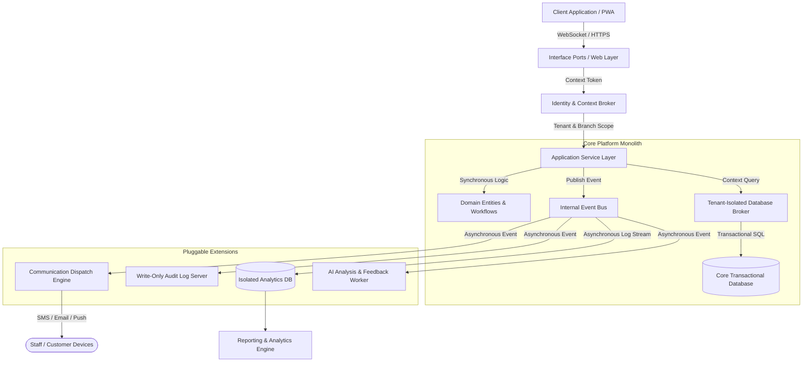

# Final Enterprise Architecture Blueprint
## Restaurant Management SaaS Platform

---

### 1. Architectural Decisions Matrix

Below is the resolution of the twenty key architectural design areas, evaluating the original proposed design against the critique to arrive at the final specification.

| # | Architecture Topic | Original Design | Independent Critique | Final Architecture Decision | Architectural Rationale |
|---|---|---|---|---|---|
| **1** | **Modular Monolith vs. Microservices** | Modular Monolith | Approved; microservices add unnecessary network & operational overhead. | **Modular Monolith** | Minimizes deployment and communication overhead at launch while maintaining strict logical database and code boundaries to allow future microservices extraction. |
| **2** | **Clean Architecture** | Strict Clean Architecture (6 layers) | High boilerplate tax; degrades developer experience (DX) and velocity. | **Pragmatic Clean Architecture** | Decouples core business domain rules from outer interfaces, but allows direct read/write bypass for simple, non-calculated data updates. |
| **3** | **Hexagonal Architecture** | Hexagonal (Ports & Adapters) | Excessive adapter code for simple database updates. | **Boundary-Locked Adapters** | Restricts Ports/Adapters strictly to high-churn external interfaces (Payments, Printing, Notification Providers, Delivery APIs) and persistence boundaries. |
| **4** | **Event-Driven Architecture (EDA)** | Fully Asynchronous Event Bus | Asynchronous events introduce latency, causing floor desynchronizations. | **Hybrid EDA** | Synchronous-in-process execution for core operations (Orders, Table occupancy) to guarantee consistency; Asynchronous events for secondary modules (Audits, Analytics, Alerts). |
| **5** | **CQRS** | Async Read/Write Databases | Replica lag causes physical routing friction on the restaurant floor. | **In-Memory Hybrid CQRS** | Active operations query the main transactional database with high-speed memory caching. Offloads read-heavy dashboards and reporting to a separate analytics replica. |
| **6** | **State Machines** | Dynamic state machine classes | Over-engineered for simple workflows. | **Declarative State Matrices** | Core lifecycles use a simple, static state matrix. Toggles and transition configurations adjust routes without running dynamic logic classes. |
| **7** | **Metadata Customization** | Free-form JSONB key-value schemas | High risk of data schema drift over multi-year lifespans. | **Dictionary-Validated Metadata** | Custom fields must be registered in a Tenant-wide schema dictionary. Custom values are validated against this dictionary to maintain consistency. |
| **8** | **Offline Strategy** | Client-generated UUIDs | Lacks conflict resolution rules for shared resources. | **Log-Structured Conflict-Free Sync** | Client logs operational changes sequentially. Conflicts on shared resources (e.g., table locks, inventory limits) default to "Branch Manager Override" or "Last Write Wins" templates. |
| **9** | **Real-Time Strategy** | Shared WebSocket updates | Broadcast storms; data leakage across branch boundaries. | **Context-Isolated Channels** | WebSocket messaging channels are strictly scoped to `tenant:<id>:branch:<id>`. Staff and customers only receive updates relevant to their active context. |
| **10** | **Analytics Strategy** | Shared database queries | Heavy reporting queries slow down dinner rush transactions. | **Isolated Analytical Data Store** | Transaction logs are streamed asynchronously to an isolated analytics engine, protecting the main database during high-traffic shifts. |
| **11** | **Notification Strategy** | Integrated alert templates | Tight coupling of formatting and business logic. | **Decoupled Template Dispatch Engine** | Modules drop abstract alert events on the bus; a dedicated communications processor formats, localizes, and dispatches them. |
| **12** | **AI Integration Strategy** | Asynchronous AI tasks | Needs learning feedback loops to remain useful. | **Passive Analytical Loop with Feedback** | AI acts as a passive subscriber. User actions (accepts/rejects) of recommendations are tracked to adapt model thresholds dynamically. |
| **13** | **Module Communication** | Direct calls vs. messages | Direct imports lead to cross-module coupling. | **Contract APIs & Event Bus** | Synchronous requests utilize strict interface contracts. Cross-module database joins are forbidden; data references are limited to IDs. |
| **14** | **Multi-Tenant Isolation** | Logical context routing | Risk of database query leakage through coding errors. | **Interceptor-Enforced Data Brokerage** | All query pipelines pass through an active context broker that automatically injects tenant and branch filters at the system level. |
| **15** | **Security Boundaries** | Context-Based Access Control (CBAC) | Audit trails need anti-tampering verification. | **Session Context with Immutable Auditing** | Identifies and logs operations against staff tokens. Log-writing bypasses Standard database paths, appending to a secure write-only audit trail. |
| **16** | **Background Processing** | Asynchronous workers | Single worker pool leads to task bottlenecks. | **Multi-Queue Priority Isolation** | Segregates background tasks into specific queues (e.g., `printing`, `data_sync`, `analytics_batch`) to protect time-critical floor tasks. |
| **17** | **Permission Evaluation** | Decoupled role mappings | Performance lags if checked dynamically per database row. | **Query-Boundary Permission Injector** | Evaluates permission filters at the database retrieval stage, returning only data records the user is authorized to view. |
| **18** | **Customization Engine** | Runtime-interpreted custom code | Sandbox execution security hazards. | **Declarative Parameter Evaluator** | Restricts custom business logic to parameters, conditions, and logical evaluations, eliminating script execution on the server. |
| **19** | **Platform Administration** | Shared management views | Overlap of platform and business admin controls. | **Air-Gapped Platform Plane** | Platform administration (licensing, branch limits, feature flags) resides in a completely separate interface scope from restaurant settings. |
| **20** | **Future Expansion Strategy** | Pluggable modules | Codebase churn when adding new capabilities. | **Core Event Interface Registry** | Core events and transitions are registered as standard hooks. Future modules (IoT, Robotics) plug in by listening to these hooks. |

---

### 2. High-Level System Architecture Design

---

### 3. Non-Negotiable Engineering Rules

Future developers of this platform must adhere strictly to these structural rules. Code reviews must reject any merge requests that violate these standards:

1.  **Never Bypass Tenant Isolation Context**: All database reads, writes, and cache queries must route through the system's isolated database broker, which automatically attaches `tenant_id` filters. Direct raw SQL execution that omits context verification is strictly forbidden.
2.  **No Direct Cross-Module Persistence Access**: A module is the sole custodian of its database tables. If Module A needs data from Module B, it must call Module B's contract API or subscribe to its published events. Cross-module database table joins are banned.
3.  **Strict Layer Dependency Flow**: Dependencies flow inward. The Domain Layer has zero dependencies. The Application Layer depends on the Domain. Interface Adapters depend on the Application. Infrastructure depends on Interface Adapters. Inward layers must never import components from outward layers.
4.  **Workflows Must Remain Declarative**: No hardcoded step transitions are allowed. Order routing, queue progression, and ticket statuses must read their sequences from a database configuration matrix.
5.  **Core Operations Must Degrade Gracefully**: If secondary services (AI, Analytics, Push Notifications, WhatsApp) are down or slow, the core operations (order submission, receipt printing, kitchen ticket prep, payment processing) must function normally.
6.  **No Business Rules in the Interface**: User Interface components are templates for rendering data and collecting inputs. All validation rules, calculations, permissions checks, and transition sequences must reside in the backend application domain.
7.  **Immutable Audit Logs**: Records tracking voids, refunds, inventory write-offs, and order deletions must be written directly to the append-only audit adapter, bypassing standard modification or deletion paths.
8.  **All Operational Tasks Use UUIDs**: Database primary keys for transactional tables (orders, reservations, payments, customer records) must be client-generated UUIDs from creation, guaranteeing synchronization compatibility in offline modes.

---

### 4. Layer Responsibilities

#### 1. Enterprise Domain Layer
*   **Purpose**: Encapsulates core business rules, entity models, and structural constraints.
*   **Responsibilities**:
    *   Maintains the state definitions for entities (Menu, Order, Table, Reservation).
    *   Enforces static business validations (e.g., "discount cannot exceed the total bill").
    *   Contains no knowledge of databases, WebSockets, or visual frameworks.

#### 2. Application Service Layer
*   **Purpose**: Coordinates operational use cases and system actions.
*   **Responsibilities**:
    *   Orchestrates workflows (e.g., executing checkout: checking table, calculating tax, capturing payment, marking table empty).
    *   Defines transactional boundaries (all-or-nothing mutations).
    *   Defines output interfaces (ports) for persistence and external integrations.

#### 3. Interface Adapters Layer
*   **Purpose**: Translates protocol data into standard application requests.
*   **Responsibilities**:
    *   Accepts WebSockets, HTTP requests, and physical barcode inputs, verifying user tokens.
    *   Constructs UI presentation views from raw domain datasets.
    *   Validates API payload formatting prior to use case execution.

#### 4. Infrastructure & Integration Layer
*   **Purpose**: Implements external communication and low-level system actions.
*   **Responsibilities**:
    *   Executes physical database queries, managing database connection pools.
    *   Dispatches raw SMS messages, emails, push notifications, and network print tasks.
    *   Maintains WebSocket channel state pools.

---

### 5. Module Responsibilities & Boundaries

*   **Platform Admin**: Manages tenant setup, active branch limits, subscriptions, and global feature flags. Boundaries: No access to branch orders, inventory, or menus.
*   **Identity & Authentication**: Verifies user sessions, checks passwords, issues context tokens, and manages dynamic permissions. Boundaries: Owns employee registry, does not manage branch operational schedules.
*   **Operational Execution (Orders/Tables/Queue/Booking)**: Manages real-time dining tables, customer queues, table bookings, and live order states. Boundaries: Owns active table and order lists; references customer profiles and menu items purely by ID.
*   **Resource Catalog (Menu/Pricing/Inventory)**: Manages catalog templates, branch-isolated pricing structures, recipes, and supplier catalogs. Boundaries: Depletes stock and updates inventory; does not process order status transitions.
*   **Billing & Payments**: Calculates totals, processes tax rules, applies discounts, logs cash registers, and interfaces with payment adapters. Boundaries: Validates checkout totals; does not manage kitchen ticket states.
*   **Communication Center**: Manages message templates, dispatch logic, and history. Boundaries: Runs in the background, consuming events published to the bus.
*   **Analytical Intelligence & AI**: Aggregates reporting metrics, captures transaction audits, and evaluates operation logs to yield recommendations. Boundaries: Read-only access; submits recommendations to a passive UI feed.

---

### 6. Core Architectural Philosophies

#### Event Philosophy
Events represent historical occurrences (`OrderSubmitted`, `PaymentSettled`). They are published asynchronously to a central event bus. Listeners act on these events out-of-band. Events are immutable, carry version timestamps, and must be processed idempotently.

#### Synchronization & Offline Philosophy
Operations assume transactional database locks for immediate consistency on active floor terminals. For offline execution, devices write operations to sequential local transaction logs. When the connection is restored, these logs are replayed. Resource conflicts default to deterministic fallback rules (e.g., "Branch Manager Override Required" flags for double-booked tables).

#### Customization Philosophy
Custom fields, menus, layout structures, and workflows are metadata-driven. The platform reads dynamic JSON specifications mapped to a Tenant dictionary, validating inputs dynamically at runtime, avoiding manual database migrations or custom codebase splits.

#### Security & Tenant Isolation Philosophy
Tenant and branch contexts are parsed at the application boundary. The data broker injects these identifiers into every query builder command, creating a permanent logical wall. Auditable changes (refunds, overrides) bypass standard modification paths, going directly to an append-only ledger.

#### Scalability Philosophy
By isolating reads from writes (using in-memory caches for live statuses and isolated databases for reporting), the system prevents analytical queries from locking tables. Scaling relies on context-based partitioning; resources are clustered around Tenant/Branch identifiers.

---

### 7. Implementation Readiness & Sequence

The system architecture is now complete and ready for detailed technical design. To ensure a logical development progression where each layer's requirements are satisfied by its dependencies, technical design must follow this sequence:

1.  **Database & Schema Architecture**: Design the schema for logical multi-tenancy, defining the metadata catalog, indexes, context-broker query structures, and the reporting replica sync.
2.  **API & Contract Architecture**: Design the synchronous inter-module boundaries, payload schemas, and core asynchronous event definitions.
3.  **Real-Time & WebSocket Channel Architecture**: Design the connection pool strategy, WebSocket routing channels (`tenant:<id>:branch:<id>`), and in-memory active cache layers.
4.  **Backend & Domain Architecture**: Design the domain entities, declarative state tables, custom authorization managers, and dependency-injection framework.
5.  **Frontend & Component Architecture**: Design the PWA client shell, layout adapters, dynamic metadata form rendering, and role-based lazy-loaded routing bundles.
6.  **AI & Analytical Integration**: Design the asynchronous task queues, recommendation feed structures, and performance logging pipelines.
7.  **Deployment & Infrastructure Architecture**: Design container configurations, load-balancers, failover storage options, and monitoring monitors.
