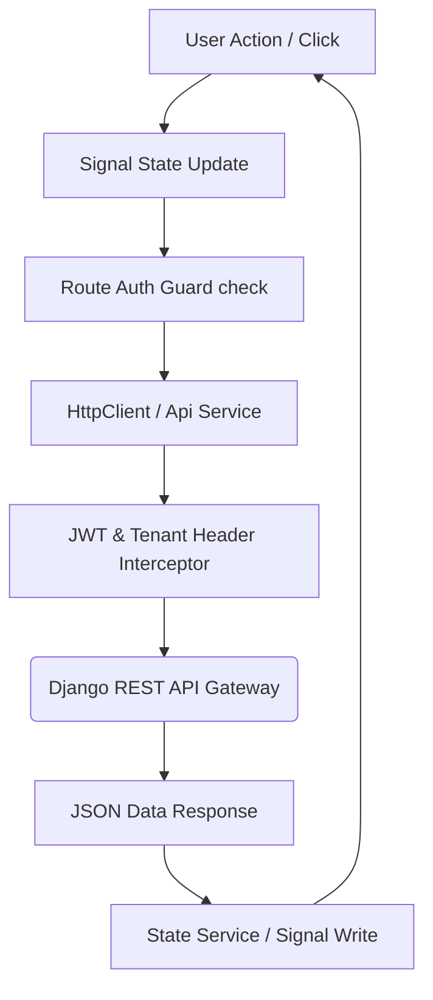

# Frontend Technical Blueprint
## Restaurant Management SaaS Platform (Angular 22 Engine)

---

### 1. Frontend Architecture Overview
The frontend is constructed as a modern, single-page application (SPA) using **Angular 22** and **Tailwind CSS 4**. It operates on a **PWA-first** architecture, utilizing Angular Service Workers for asset caching and client-side storage for offline resilience. The system enforces strict reactivity using **Angular Signals** for component state and **RxJS** for asynchronous event streaming and WebSocket feeds.

---

### 2. Core Frontend Strategy

#### 1. Angular Application Organization
The codebase uses a clean division of features. It isolates core services, shared visual elements, and lazy-loaded business modules:
*   `core/`: Single-instance services (auth, API gateways, connection brokers, state machines, global error interceptors).
*   `shared/`: Reusable components (buttons, input fields, tables, dial boxes) and pipes.
*   `features/`: Lazy-loaded business modules containing smart/presentational components mapped to user roles.

#### 2. Angular-Native State Management Strategy
We select **Angular Signals** combined with **RxJS BehaviorSubject Services** for state management:
*   **Signals (Local/UI State)**: Used for granular component reactivity, input changes, and local view toggles. This avoids triggering full-page change detection passes, keeping screens fast on low-power tablets.
*   **RxJS (Event Streams)**: Used for WebSocket event pipelines and HTTP operations. Events are piped from WebSockets directly into write-only Signal states that notify rendering components.

#### 3. Request & Auth Lifecycle

---

### 3. Interface Systems & Dynamic Layouts

#### Routing & Lazy Loading
*   **Feature Bundling**: Feature routes are lazy-loaded based on application sub-paths (e.g., `/kitchen`, `/admin`, `/checkout`).
*   **Guards Verification**: Navigation triggers functional route guards (`AuthGuard`, `PermissionGuard`, `TenantContextGuard`) to verify session token status and validate permission access keys.

#### Theme, Styling & Branding
*   **Tailwind CSS 4 Configuration**: Styling utilizes custom design tokens defined in Tailwind.
*   **Dynamic Custom CSS Variables**: Branding choices (primary color, logo paths) are retrieved from the tenant’s metadata configuration API. These settings write directly to CSS custom variables (e.g., `--primary-color`) on the root document node at startup.

---

### 4. Real-Time, Synchronization & Offline Systems

#### Real-Time UI Synchronization
*   **WebSocket Connection Service**: A persistent, singleton connection broker manages active WebSocket lines.
*   **Reconnection Backoff**: Incorporates exponential backoff to handle dropouts.
*   **State Propagation**: Incoming messages trigger Signal updates. This instantly repaints UI components (e.g., advancing a queue card) without page refreshes.

#### Offline & Sync Strategy
*   **Static Asset Caching**: Angular service workers cache index structures, font files, and assets.
*   **Offline Transaction Log**: Critical mutations (e.g., adding an order item, changing table allocations) are intercept-routed and written to a client-side database (such as IndexedDB).
*   **Synchronization Scheduler**: When online status is restored, an background sync broker reads the client database log and replays transactions sequentially to the backend server.

---

### 5. Frontend Feature Modules

The frontend features are segregated into six lazy-loaded feature modules:

#### 1. `features.platform-admin`
*   **Purpose**: Tenant provisioning, branch limitations configurations, and platform usage analytics.
*   **Dependencies**: `core/services/api`.
*   **Guards**: `PlatformAdminGuard`.
*   **Services**: `PlatformAdminService` (Tenant list, limits, updates).
*   **Real-Time / Offline**: Direct HTTP-only. No offline queue storage; requires online connection.

#### 2. `features.iam`
*   **Purpose**: Staff login, customer OTP verification forms, password resets, and user profile management.
*   **Dependencies**: `core/services/auth`.
*   **Guards**: None (Public access).
*   **Services**: `AuthService` (Credentials validation, token store, session checks).
*   **Real-Time / Offline**: Public access; uses HTTP.

#### 3. `features.operations`
*   **Purpose**: Live dining tables visual grid, customer queue management, walk-in register, and reservation calendars.
*   **Dependencies**: `shared/components/dialogs`, `shared/components/tables`.
*   **Guards**: `ActiveSessionGuard`, `OperationsRoleGuard`.
*   **Services**: `OperationsStateService` (Active table states, queue lists, reservation bookings).
*   **Real-Time / Offline**: Deep WebSocket syncing. Order inputs write to local IndexedDB logs when connectivity drops.

#### 4. `features.kitchen`
*   **Purpose**: Card-based ticket preparation displays, order status updates, kitchen station filters.
*   **Dependencies**: `shared/components/dialogs`.
*   **Guards**: `ActiveSessionGuard`, `KitchenRoleGuard`.
*   **Services**: `KitchenStateService` (Active tickets list, ticket times track).
*   **Real-Time / Offline**: Push notification sounds. Displays current state cached locally if disconnected, syncing tickets when connection returns.

#### 5. `features.billing`
*   **Purpose**: Cart builder, checkout invoice calculation, split-bill calculator, cash drawer logs, and payments.
*   **Dependencies**: `shared/components/tables`, `shared/components/forms`.
*   **Guards**: `ActiveSessionGuard`, `CashierRoleGuard`.
*   **Services**: `BillingService` (Bill splits, invoice totals, payment dispatch).
*   **Real-Time / Offline**: Live receipt prints. Local sync stores offline payment signatures for manual confirmation if card terminals fail.

#### 6. `features.catalog`
*   **Purpose**: Menu listings, branch pricing controls, recipe catalogs, stock alerts, and supplier logs.
*   **Dependencies**: `shared/components/forms`.
*   **Guards**: `ActiveSessionGuard`, `CatalogManagerGuard`.
*   **Services**: `CatalogService` (Menu items configuration, ingredient counts, purchase orders).
*   **Real-Time / Offline**: Caches menu templates locally. Edits to pricing or items are queued offline, syncing once network verifies.

---

### 6. Component Standards

*   **Smart Components**:
    *   Inject state services and select data streams.
    *   Orchestrate navigation, trigger database mutations, and handle dialog overlays.
    *   Do not define visual formatting rules (delegated to HTML templates).
*   **Presentational Components**:
    *   Accept data using `@Input` bindings and notify parent components using `@Output` events.
    *   Independent of application state services or HTTP client calls.
*   **Reusable Form Components**:
    *   Implements Angular's `ControlValueAccessor` to bind to dynamic form layouts seamlessly.
*   **Dialogs / Modals**:
    *   Must be injected dynamically via overlay templates, keeping routes clean.

---

### 7. Frontend Golden Rules

Angular frontend developers must strictly follow these rules:

> [!CAUTION]
> 1. **Never Place Business Rules in Components**: Component classes manage view state (e.g., open/close states, active index). Rules like pricing, tax percentages, status paths, and discount caps reside in the domain layer on the backend.
> 2. **Never Directly Modify Shared State**: State changes must route through dedicated write actions in the State Service. Direct mutation of service-exposed objects is forbidden.
> 3. **Never Bypass Route Guards**: Business actions must be protected by permission and context verification guards. Direct template navigation bypassing route configurations is banned.
> 4. **Never Hardcode Permission Roles**: UI components must check permission keys (e.g., `orders.delete`) returned by the identity broker, never role names (e.g., `Waiter`).
> 5. **No Blocking Operations in the UI Thread**: Long-running background operations (sync tasks, analytical renders) must run asynchronously, displaying lightweight loading cues without locking the main thread.
> 6. **Always Subscribe with Clean Up**: To prevent memory leaks, subscriptions to RxJS streams must use proper cleanup hooks (e.g., `takeUntilDestroyed` or Signal-based subscriptions).
> 7. **Never Execute Direct API Calls Inside Components**: UI components must call State or API Services. Directly instantiating or invoking HTTP requests inside components is forbidden.
