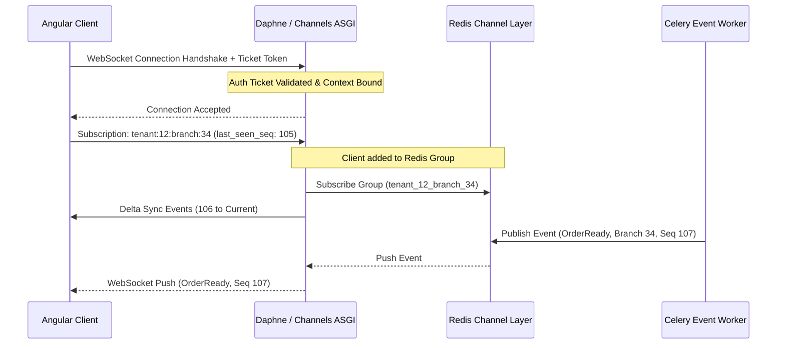

# Real-Time Technical Blueprint
## Restaurant Management SaaS Platform (WebSockets & Event Sync Engine)

---

### 1. Real-Time Architecture Overview
Real-time operations are governed by an **event-driven synchronization framework** coordinating **Django Channels** (ASGI), **Redis Channel Layers**, and **Angular 22** client stores. The system enforces strict logical isolation at the tenant/branch boundary and utilizes sequence-tracked message logs to guarantee data consistency during network dropouts.

---

### 2. Connection & Communication Flow

---

### 3. Core Channel & Event Organization

#### 1. Channel Structuring & Naming Standard
To prevent broadcast storms, channels are partitioned into isolated namespaces:
*   `tenant:<tenant_id>:branch:<branch_id>`: General branch updates (e.g., table releases).
*   `tenant:<tenant_id>:branch:<branch_id>:role:<role_name>`: Role-specific feeds (e.g., kitchen prep lists).
*   `user:<user_id>`: Direct notifications (e.g., personal alerts, token resets).

#### 2. WebSocket Security Handshake
*   **Ticket Token Authentication**: WebSockets do not accept raw JWTs in request payloads. The client makes a REST request to obtain a short-lived, single-use ticket token.
*   **Handshake Clearance**: The client passes this ticket as a query parameter during the WebSocket handshake. The ASGI connection handler validates the ticket, binds the associated tenant/branch/user context variables, and accepts the connection.

#### 3. Ordered Event Delivery Strategy (At-Least-Once)
*   **Sequence Indexing**: Every broadcast event contains a monotonically increasing sequence number (`seq_num`) unique to its channel stream.
*   **Client Tracking**: The client application registers the highest sequence number received (`last_seen_seq`) in local memory.
*   **Reconnection catch-up**: If a connection is lost, upon reconnection the client submits its `last_seen_seq` as part of the channel subscription payload. The server retrieves the event log and pushes the missing events (deltas).

---

### 4. Event Types Classification

| Event Category | Purpose | Producer | Consumers | Priority | Persistence | Retry Policy |
|---|---|---|---|---|---|---|
| **Operational** | Syncs floor and kitchen state (orders, tables, queues). | Backend execution service. | Wait staff, kitchen, cashier displays. | **High** | Yes (DB log) | 3 retries; fallback to REST query. |
| **Notification** | Sends popups, alert badges, and user reminders. | Event processing task. | Specific user channels. | **Medium** | Yes (History log) | Retry until expiry (TTL 24h). |
| **System** | Flags licensing updates, feature locks, or maintenance. | Platform admin plane. | Active tenant browser tabs. | **Critical** | Yes (DB log) | Retry indefinitely until success. |
| **Analytics** | Updates dashboard charts and metric totals. | Billing and operations. | Managers, Owner dashboards. | **Low** | No (Transient) | No retry (loss acceptable). |
| **AI Alerts** | Pushes bottleneck warnings and supply warnings. | AI analytical worker. | Managers, Branch display. | **Low** | Yes (Dashboard log) | No retry. |
| **Audit Logs** | Captures overrides, refunds, and permission shifts. | Application services. | Immutable audit worker. | **High** | Yes (Immutable WORM) | Retry with backoff; block on failure. |
| **Integration** | Dispatches updates to delivery portals or SMS. | Event broker. | External integration workers. | **Medium** | Yes (Queue log) | Exponential backoff (max 5 retries). |

---

### 5. Client Synchronization & State Recovery

#### 1. Initial Connection & Reconnect
During startup or reconnection, client components query their baseline records via REST. Once the WebSocket connection is established and the `last_seen_seq` is verified, the client subscribes to active channels and processes the returned delta events to sync the local state.

#### 2. Heartbeats & Disconnect Detection
*   **Ping-Pong Loop**: The client issues a `ping` frame every 30 seconds. The server responds with a `pong` frame.
*   **Dropout Detection**: If the client fails to receive a `pong` response twice consecutively, it registers the connection as dropped, switches the UI status indicator to offline, and starts reconnection attempts.

#### 3. Optimistic UI Updates & Rollback Strategy
*   **Immediate Rendering**: Client applications immediately render simple UI updates (e.g., dragging a ticket card to "Preparing") before server confirmation.
*   **Rollback Verification**: If a transaction fails or the server returns an error event (e.g., `OrderActionRejected`), the client rolls back the local Signal state to the last known valid sequence state and displays a warning toast.

---

### 6. Event Delivery Rules & Guarantees

*   **At-Least-Once Delivery**: The combination of local state tracking (`last_seen_seq`) and database-backed event history guarantees that no events are lost during brief drops.
*   **Idempotency Key Verification**: Transaction writes carry client-generated IDs. If a client resubmits a state mutation during sync, the server ignores duplicate operations.
*   **Sequence Ordering Guarantee**: Events are written to the channel stream sequentially. Out-of-order messages received by the client (where `seq_num` does not match `last_seen_seq + 1`) trigger the client to block processing and request a delta re-sync.

---

### 7. Real-Time Golden Rules

Real-time developers must adhere strictly to these rules:

> [!CAUTION]
> 1. **Never Send Transaction Writes Through WebSockets**: WebSockets are a downstream notification channel. All data changes (creates, updates, deletes) must execute as REST requests.
> 2. **Never Broadcast Beyond Tenant Boundaries**: Event channels are strictly partitioned. An event from Tenant A must never be routed to channels belonging to Tenant B.
> 3. **Never Trust Client State**: Client applications must validate event payloads against their local cache, and the backend must validate all request parameters before broadcasting state shifts.
> 4. **Never Assume Ordered Network Delivery**: Clients must verify the incoming `seq_num` before rendering, rejecting or buffering out-of-order payloads.
> 5. **Never Block Operations on WebSocket Delivery**: Core backend database transactions must execute independently. WebSocket broadcasts run asynchronously, ensuring that connection delays on one client do not slow down the server.
> 6. **Never Broadcast Full Objects When Deltas Suffice**: Network payloads must remain small. Broadcast only the changed fields and entity IDs (e.g., `{"id": "order-123", "status": "Ready"}`), rather than returning the entire order document.

---

### 8. Implementation Readiness

The real-time architecture is complete. We have successfully defined the channel structure, WebSocket authentication handshake, ordered delivery guarantees, offline recovery sync loops, and event types.

No further design details are needed to start implementation.
