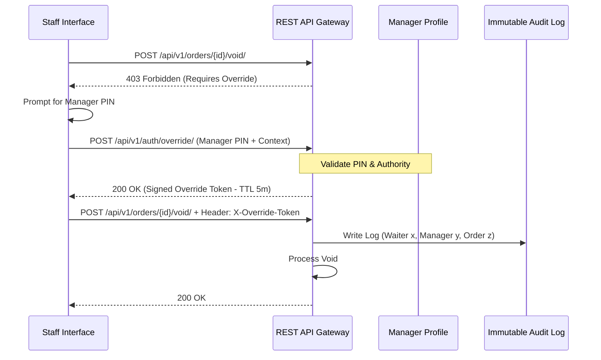

# Security Technical Blueprint
## Restaurant Management SaaS Platform (Enterprise Access Control & Isolation)

---

### 1. Security Architecture Overview
The security architecture enforces a **Zero-Trust Model** across all layers. Multi-tenant isolation is enforced at the database layer using PostgreSQL Row-Level Security (RLS) managed by context interceptors. Authorization utilizes Context-Based Access Control (CBAC) checked at the query boundary. All communications use TLS 1.3, and sensitive fields use envelope encryption.

---

### 2. Session & Auth Lifecycle

#### JWT & Session Lifecycle
*   **Access Token**: Short-lived (15 minutes), stored in memory by the client application, and passed in the `Authorization: Bearer` header.
*   **Refresh Token**: Long-lived (7 days), stored in an `HttpOnly`, `Secure`, `SameSite=Strict` cookie to protect against Cross-Site Scripting (XSS) and Cross-Site Request Forgery (CSRF).
*   **Token Rotation**: Implements single-use token rotation; refreshing a token invalidates the previous refresh token.

#### Manager Override Strategy
Operations that change order balances, process refunds, or void sent items require a manager override:

*   **Override Tokens**: The manager inputs a quick auth PIN at the waiter’s terminal. The server issues a short-lived (5-minute TTL), single-use **Override Token** signed by the manager’s context.
*   **Audit Association**: The override token is attached to the transaction header, logging both the initiating staff member and the authorizing manager.

---

### 3. Data Protection & Cryptography

#### Tenant Isolation Enforcement
*   **PostgreSQL Row-Level Security (RLS)**: Operational tables use PostgreSQL RLS enabled at the database engine boundary.
*   **Session Context Locking**: Upon checkout of a database connection, the data broker executes a session lock query: `SET LOCAL app.current_tenant_id = x;`. The database engine blocks any query attempting to access rows not matching `app.current_tenant_id`.

#### Encryption and Key Management
*   **In Transit**: TLS 1.3 is enforced for all external HTTPS and WebSocket connections.
*   **At Rest**: Storage volumes use AES-256 filesystem encryption. Sensitive database fields (e.g. integration keys, customer PII) use envelope encryption via AES-256-GCM.
*   **Secrets Management**: Database passwords, signing keys, and external credentials reside in isolated vaults, injected into container environments at runtime.

---

### 4. Security Boundaries

*   **Platform boundary**: Platform Team has visibility over tenant billing and license caps. They have no access to customer credentials, sales balances, or operational logs unless authorized.
*   **Tenant boundary**: Absolute isolation boundary. Data is logically walled. Access permissions do not span across tenants.
*   **Branch boundary**: Restricts staff credentials to active locations. A Branch Manager of Branch A cannot review or modify Branch B's register cash balances.
*   **User/Role boundary**: Users only access use cases matching their active Context permission key set.
*   **Customer boundary**: Isolated self-service access via OTP verification. Customers cannot access staff directories or backend menu inventory configurations.
*   **Integrations & Workers**: Background Celery workers and partner API keys execute within a restricted permission context, logged under specific integration accounts.

---

### 5. Security Events Matrix

| Event Category | Producer | Consumers | Audit Requirements | Alerting Requirements | Retention Policy |
|---|---|---|---|---|---|
| **Authentication Failures** | Auth Service | System Admin, Security Log | Client IP, username, timestamp. | Alert on 5 failures within 1 minute from a single IP. | 90 days |
| **Authorization Denials** | Context Broker | Security Log, Tenant Owner | User ID, attempted action, context details. | Alert on consecutive denials for a single user. | 180 days |
| **Privilege Escalation** | IAM Service | Audit Log, Tenant Owner | Admin ID, target user ID, permission keys changed. | Instant alert to Tenant Owner email/SMS. | Permanent (2 years hot) |
| **Refunds & Voids** | Billing App | Audit Log, Cashier Manager | Cashier ID, order ID, cash value, timestamp. | Log details to immutable audit store. | Permanent |
| **Manager Overrides** | Operations App | Audit Log, Tenant Owner | Waiter ID, Manager ID, voided resource ID. | Dynamic dashboard summary for managers. | Permanent |
| **Configuration Changes** | Tenants App | Audit Log, Platform Admin | User ID, configuration variable, before/after values. | Log changes to tenant metadata dictionaries. | Permanent |
| **Suspicious Activity** | API Gateway | Intrusion Alerts, Security Log | IP address, payload signatures, target endpoints. | Block IP at gateway; dispatch high-priority alert. | 180 days |
| **Session Expirations** | Auth Service | System Log | Token expiry timestamp, user ID. | Normal telemetry log; no alert required. | 30 days |

---

### 6. Security Golden Rules

Security developers must adhere strictly to these rules:

> [!CAUTION]
> 1. **Never Trust Client Input**: Sanitize, escape, and validate all fields at the gateway. Client validation is only a UI convenience.
> 2. **Never Bypass Tenant Isolation Context**: All database operations must pass through query builders governed by PostgreSQL RLS. Raw query overrides are forbidden.
> 3. **Never Store Secrets in Source Code**: Database credentials, signing tokens, API keys, and certificates must reside in secure environment vaults, never in source code.
> 4. **Never Log Sensitive Information**: Personally Identifiable Information (PII), credentials, JWTs, and payment tokens must be masked in application logs.
> 5. **Never Allow Privilege Changes Without Audit**: Role creation, permission adjustments, and user status modifications must be signed by the author and logged to the immutable audit store.
> 6. **Never Use Session Cookies for WebSockets**: Authenticate WebSockets via single-use, short-lived tokens generated via REST, preventing CSRF/session hijack attacks.
> 7. **Envelope Encrypt Integration Keys**: Third-party credentials (delivery API keys, payment certificates) must be envelope encrypted at rest inside the database.

---

### 7. Implementation Readiness

The security architecture is complete. We have successfully defined the token lifecycle, RLS-based tenant isolation strategy, manager override workflows, encryption standards, secrets management, and security boundaries.

No further design details are needed to start writing secure backend and frontend code.
