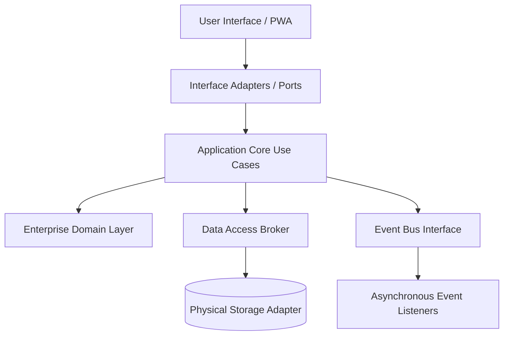

# Enterprise System Architecture
## Restaurant Management SaaS Platform

---

### 1. Overall System Vision
The platform is designed as an extensible, real-time operating system for global restaurant networks. The vision is to establish a modular, secure, and highly observable core that handles high-velocity operations (orders, checkout, kitchen) while supporting dynamic, runtime customizations (workflows, roles, fields) without requiring changes to the software's codebase.

---

### 2. Architectural Style
We adopt a hybrid architectural style blending **Clean Architecture (Ports and Adapters / Hexagonal)** with a **Microkernel and Event-Driven Architecture (EDA)**:
*   **Clean Architecture**: Isolates core business domain logic (state machines, validation, calculations) from outer framework and infrastructure concerns.
*   **Microkernel**: A stable, lightweight core handles tenant onboarding, security, and basic data routing, while other capabilities (integrations, reporting, AI engines) exist as pluggable extensions.
*   **Event-Driven (EDA)**: Modules communicate asynchronously using event loops. This ensures that actions propagate in real time without creating tight runtime coupling.

---

### 3. Major Platform Layers
1.  **Enterprise Core Domain Layer**: Defines pure business entities, custom validation schemas, and state machine transitions. It has zero external dependencies and remains immune to framework changes.
2.  **Application Use Case Layer**: Coordinates business workflows, transactional boundaries, and user authorizations. It defines the "ports" (interfaces) for data persistence and external integrations.
3.  **Interface Adapters / Presenters Layer**: Converts user actions, WebSockets messages, and external webhook triggers into standard requests for the application layer.
4.  **Infrastructure & Adapters Layer**: Implements concrete storage engines, network push mechanisms, and external communication gateways.

---

### 4. Core Business Domains
*   **Platform Operations**: Tenant provisioning, license validation, subscription billing, and multi-tenant resource controls.
*   **Identity & Access Management (IAM)**: Decentralized authentication, dynamic role evaluation, and context-aware authorization.
*   **Operational Execution**: Live table mapping, real-time order states, kitchen line management, and checkout pipelines.
*   **Resource Catalog**: Menu configurations, dynamic inventories, recipes, and supplier matrices.
*   **Communication Hub**: Notification templates, campaign management, and message delivery dispatch.
*   **Analytical Intelligence**: Operational reporting, audit trails, and AI recommendation pipes.

---

### 5. Module Boundaries
Modules are strictly bounded contexts. A module cannot directly query or manipulate the database tables of another module.
*   **Strict APIs**: Inter-module communication occurs via formal interface contracts or asynchronous messages.
*   **Logical Partitioning**: Data stores are separated at a logical level, preventing direct table joins across module boundaries.

---

### 6. Module Responsibilities
*   *Platform Admin*: Enforces branch limits and manages features flags across tenants.
*   *Identity & Auth*: Resolves employee credentials and returns active permissions for a specific branch context.
*   *Order Manager*: Updates order states and emits operational triggers (e.g., `OrderSubmitted`, `PaymentSettled`).
*   *Kitchen Queue*: Listens for order submissions and tracks line prep speeds.
*   *Inventory Handler*: Depletes stock when items are cooked and triggers alert states for low-stock ingredients.
*   *Billing Coordinator*: Generates payment totals, applies discounts, and verifies receipt generation.

---

### 7. Communication Philosophy
*   **Asynchronous-First**: Long-running or non-blocking processes (updating sales reports, emailing receipts, updating AI models) must run out-of-band.
*   **Synchronous-by-Exception**: Synchronous queries are permitted only for actions requiring immediate validation (e.g., checking if a credit balance is sufficient to close a table).
*   **Message Contracts**: All interfaces use strictly structured data schemas to enforce stability across version updates.

---

### 8. Event Flow Philosophy
1.  **State Change Event**: An execution module modifies its internal state and publishes a structured event (e.g., `TableOccupied`).
2.  **Event Bus Brokerage**: The central event bus accepts the event and logs it.
3.  **Dynamic Dispatch**: Subscribers (listeners) receive the event payload:
    *   The *Queue* module updates waiting guests.
    *   The *Kitchen* gets ready for incoming orders.
    *   The *Manager's* floor plan lights up.
4.  **Idempotence Guarantee**: Event handlers are designed to be idempotent; processing the same event multiple times yields the same result.

---

### 9. Dependency Philosophy
*   **Dependency Inversion**: Outer layers (infrastructure, databases, UI) depend on the inner layers (use cases, domains). Inner layers never know about the outer layers.
*   **Contract-Based Routing**: Core business operations depend on interfaces (ports), not concrete implementations. A third-party service is bound at runtime, allowing seamless testing and replacement.

---

### 10. Extensibility Strategy
*   **Metadata-Driven Schema Extensibility**: Fields and form screens are defined by configuration matrices. When a user requests a custom attribute, the system stores it in a flexible metadata engine, preventing physical schema migrations.
*   **Dynamic State Engines**: Order and reservation states are governed by state-machine configurations, allowing owners to add or bypass states at runtime.
*   **Plugin Gateways**: Third-party services hook into defined lifecycle adapters (e.g., `PrePaymentGateway`, `PostOrderDispatch`).

---

### 11. Scalability Strategy
*   **Command Query Responsibility Segregation (CQRS)**: Read operations (analytics, reporting dashboards) are separated from write operations (taking orders, processing payments) to prevent analytics queries from slowing down floor operations.
*   **Horizontal Scope Partitioning**: Systems are partitioned horizontally using the Tenant/Branch hierarchy. Requests are routed and locked to context-specific resources.
*   **Edge Push Optimization**: Active states are broadcasted selectively. Rather than broadcasting full state documents, the system pushes lightweight status changes.

---

### 12. Maintainability Strategy
*   **Testability Isolation**: By decoupling business domains from the UI and databases, domain rules can be tested in pure, fast unit-test environments.
*   **Independent Upgrades**: Modularity allows developers to deploy updates to the reporting engine or AI analysis module without risking the integrity of the core order-taking engine.

---

### 13. Separation of Concerns
*   **UI Separation**: User interface components handle only visual state and user input. They have no knowledge of database structures or core business algorithms.
*   **Domain Isolation**: Business policies (e.g., "a table cannot be closed until the payment matches the order balance") are implemented exclusively within the Enterprise Core Domain, never on the client or in database procedures.

---

### 14. Failure Isolation Strategy
*   **Graceful Degradation**: If the inventory module goes offline, the ordering system remains open, using cached catalog lists. If payment gateways fail, the platform logs offline transactions for manual clearance.
*   **Circuit Breakers**: External integrations (e.g., delivery platforms, SMS gateways) are wrapped in circuit breakers. If a third-party API slows down, the system temporarily isolates the connection, preventing it from consuming platform resources.

---

### 15. Security Philosophy
*   **Token-Based Claims**: All requests must bear cryptographically validated identity and context metadata (Tenant ID, Branch ID, User Permissions).
*   **Context-Based Access Control (CBAC)**: Permissions are validated dynamically against the active branch context, preventing a manager of Branch A from altering the inventory of Branch B.
*   **Data Masking**: PII data (customer contact info) is encrypted at rest and masked in standard operational views, visible only to authorized operational roles.

---

### 16. Multi-Tenant Philosophy
*   **Logical Context Isolation**: The platform uses logical partitioning. Every query pipeline is intercepted by a Context Validator that automatically injects the tenant and branch scopes.
*   **Resource Quotas**: Platform administration sets physical constraints (e.g., API limits, storage caps, active branch counts) per tenant to ensure a single tenant cannot degrade platform performance for others.

---

### 17. Platform Evolution Strategy
*   **Core Microkernel Stability**: The core interfaces (tenant registration, auth, event bus) change slowly and remain highly backward-compatible.
*   **Adapter Versioning**: Interface adapters are versioned, allowing older versions of custom dashboards or API clients to coexist with upgraded backend domains.

---

### 18. Architectural Risks
*   **Customization Overhead**: Complex tenant configurations (rules, fields, roles) add processing latency during page rendering and query building. *Mitigation: Cache validated dynamic schema definitions in-memory.*
*   **Event Broker Latency**: In high-volume environments, delays on the event bus could cause the kitchen screen to desynchronize from table orders. *Mitigation: Core order submission runs on synchronous write loops; kitchen screen updates are offloaded asynchronously.*
*   **Multi-Tenant Code Leakage**: Buggy custom workflows created by one tenant must never execute script paths that impact other tenants. *Mitigation: Sandbox custom expressions or restrict workflows to non-executable declarative configurations.*

---

### 19. Alternative Architectures Considered
*   **Database Schema-Per-Tenant**: Deemed too high-maintenance. Scaling to thousands of tenants results in massive schema migration backlogs and connection pool depletion. Logical isolation with context-based routing was chosen instead.
*   **Full Microservices**: Considered too complex for early-stage operational cohesion, introducing high network overhead and complex distributed transaction scenarios. Clean Architecture Monolith with logical modularity was selected to balance simplicity and future microservice splits.

---

### 20. Final Architecture Recommendation
We recommend a **Modular Monolith using Clean Architecture and Event-Driven Modules**. It provides the operational simplicity and transaction safety of a single core codebase while achieving the logical isolation, testability, and real-time responsiveness of a microservices design. Multi-tenancy is logically enforced via context interceptors, and customization is metadata-driven, ensuring long-term maintainability.
